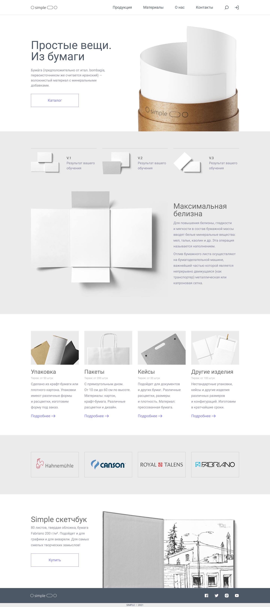

# Проект «Simple»

## Содержание

- [Технологии](#технологии)
- [Описание проекта](#описание-проекта)
- [Скриншот проекта](#скриншот-проекта)
- [Ссылки](#ссылки)
- [Источники](#источники)

## Технологии

## Описание проекта

Проект реализует одностраничный сайт посвещеный вещам из бумаги

## Скриншот проекта

## Ссылки

- [Репозиторий проекта](https://github.com/LeaTrixWizzer/simple.git)
- [Макет проекта](https://www.figma.com/design/sJwabNIQ83JF9XIGfYCOl4/Simple?t=JMpUuZXGjg3v3aLM-0)
- [Публикация проекта]()

## Источники

@verstaem.online
